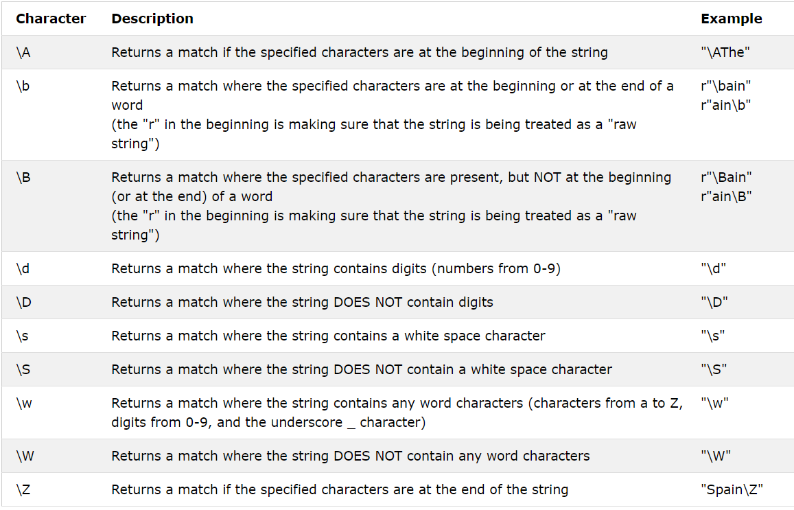
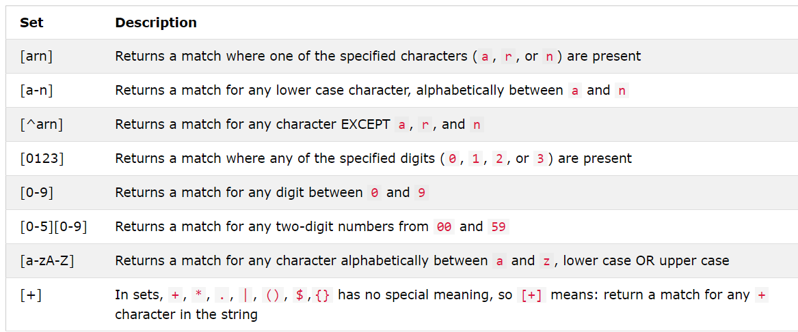

# Python Regular Expression

A RegEx, or Regular Expression, is a sequence of characters that forms a search pattern.
RegEx can be used to check if a string contains the specified search pattern.

## RegEx Module
Python has a built-in package called re, which can be used to work with Regular Expressions.

Import the re module:

` import re `

## RegEx in Python

When you have imported the re module, you can start using regular expressions:

Example
Search the string to see if it starts with "The" and ends with "Spain":

                        `
                        import re

                        txt = "The rain in Spain"
                        x = re.search("^The.*Spain$", txt)
                        `

## RegEx Functions

The re module offers a set of functions that allows us to search a string for a match:

## Metacharacters

Metacharacters are characters with a special meaning:

## Special Sequences

A special sequence is a \ followed by one of the characters in the list below, and has a special meaning:

## Sets

A set is a set of characters inside a pair of square brackets [] with a special meaning:

## The findall() Function

The findall() function returns a list containing all matches.

**Example**
Print a list of all matches:

                    `import re

                    txt = "The rain in Spain"
                    x = re.findall("ai", txt)
                    print(x)`

The list contains the matches in the order they are found.

If no matches are found, an empty list is returned:

**Example**
Return an empty list if no match was found:

                    `import re

                    txt = "The rain in Spain"
                    x = re.findall("Portugal", txt)
                    print(x)`

## The search() Function

The search() function searches the string for a match, and returns a Match object if there is a match.

If there is more than one match, only the first occurrence of the match will be returned:

**Example**
Search for the first white-space character in the string:

                    `import re

                    txt = "The rain in Spain"
                    x = re.search("\s", txt)

print("The first white-space character is located in position:", x.start())
If no matches are found, the value None is returned:`

**Example**
Make a search that returns no match:

                    `import re

                    txt = "The rain in Spain"
                    x = re.search("Portugal", txt)
                    print(x)`

# The split() Function

The split() function returns a list where the string has been split at each match:

**Example**
Split at each white-space character:

                    import re

                    `txt = "The rain in Spain"
                    x = re.split("\s", txt)
                    print(x)`
You can control the number of occurrences by specifying the maxsplit parameter:

**Example**
Split the string only at the first occurrence:

                    `import re

                    txt = "The rain in Spain"
                    x = re.split("\s", txt, 1)
                    print(x)`

# The sub() Function

The sub() function replaces the matches with the text of your choice:

**Example**
Replace every white-space character with the number 9:

                    `import re

                    txt = "The rain in Spain"
                    x = re.sub("\s", "9", txt)
                    print(x)`
You can control the number of replacements by specifying the count parameter:

**Example**
Replace the first 2 occurrences:

                    `import re

                    txt = "The rain in Spain"
                    x = re.sub("\s", "9", txt, 2)
                    print(x)`

# Match Object

A Match Object is an object containing information about the search and the result.

Note: If there is no match, the value None will be returned, instead of the Match Object.

**Example**
Do a search that will return a Match Object:

                    `import re

                    txt = "The rain in Spain"
                    x = re.search("ai", txt)
                    print(x) #this will print an object`

The Match object has properties and methods used to retrieve information about the search, and the result:

.span() returns a tuple containing the start-, and end positions of the match.
.string returns the string passed into the function
.group() returns the part of the string where there was a match

**Example**
Print the position (start- and end-position) of the first match occurrence.

The regular expression looks for any words that starts with an upper case "S":

                    `import re

                    txt = "The rain in Spain"
                    x = re.search(r"\bS\w+", txt)
                    print(x.span())`

**Example**

Print the string passed into the function:

                    `import re

                    txt = "The rain in Spain"
                    x = re.search(r"\bS\w+", txt)
                    print(x.string)`

**Example**

Print the part of the string where there was a match.

The regular expression looks for any words that starts with an upper case "S":

                    import re

                    txt = "The rain in Spain"
                    x = re.search(r"\bS\w+", txt)
                    print(x.group())